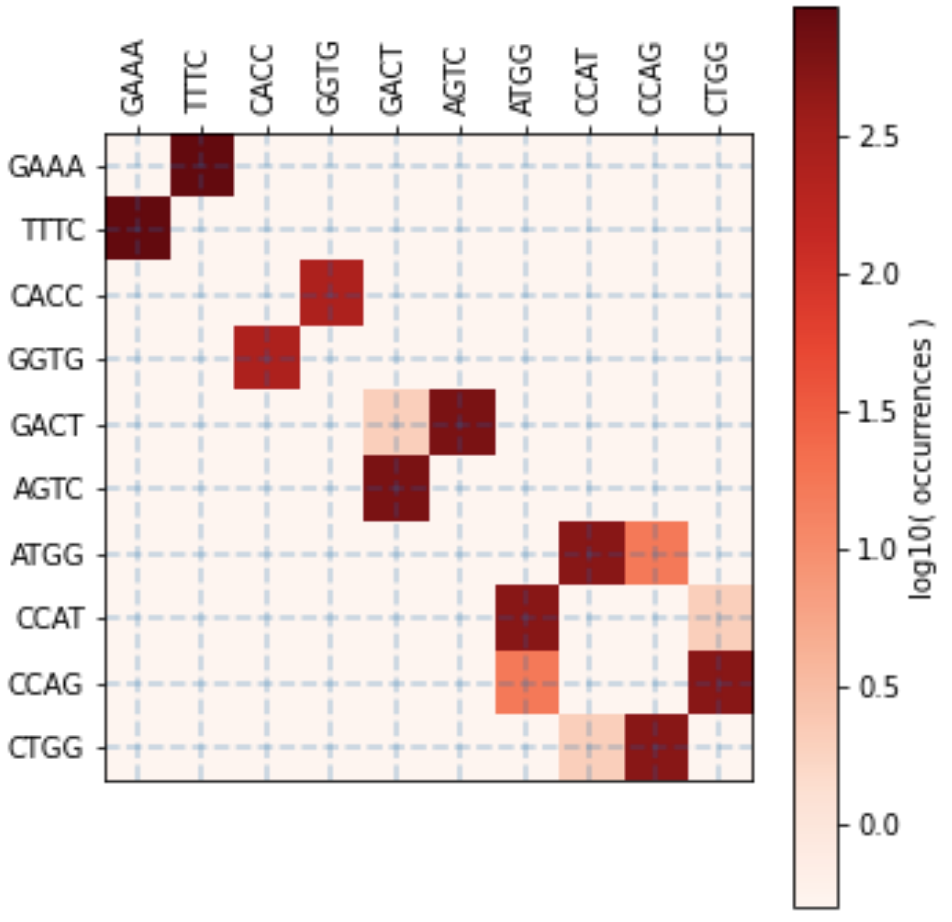
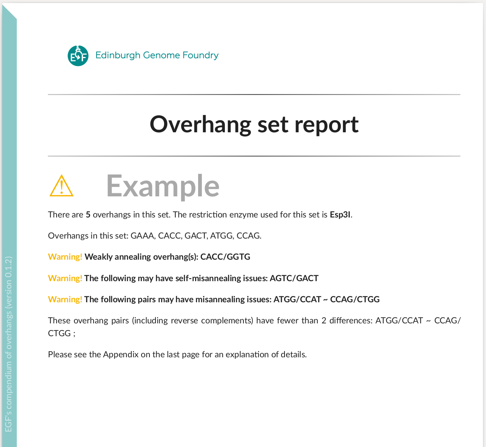

<p align="center">

</p>


# EGF's Compendium of overhangs

[](https://github.com/Edinburgh-Genome-Foundry/Overhang/actions/workflows/build.yml)
[](https://coveralls.io/github/Edinburgh-Genome-Foundry/Overhang?branch=main)


This Python package generates a description of an input set of DNA overhangs and outputs a PDF file.
Additionally, it evaluates suitability of an input set of overhangs for Golden Gate DNA assembly.


## Install

```
pip install overhang
```


## Usage

```python
import overhang as oh

overhang = oh.Overhang("TCAT")
dir(overhang)

overhang_classes = oh.generate_all_overhangs()
oh.write_pdf_report(target="examples/compendium_Esp3I.pdf", overhangs=overhang_classes)
```
See [compendium_Esp3I.pdf](https://github.com/Edinburgh-Genome-Foundry/Overhang/blob/main/examples/compendium_Esp3I.pdf).

Inspect a set of overhangs for assembly:
```python
overhangset = oh.OverhangSet(
    overhangs=["ATGG", "GAAA", "CACC", "GACT", "ATGG", "CCAG",], name="Example",
)
oh.write_overhangset_report("examples/set_report_Example.pdf", overhangset)
# Esp3I Tatapov plot (37 Celsius, 1 hour):
```
<p align="center">

</p>

The first page of [the report](https://github.com/Edinburgh-Genome-Foundry/Overhang/blob/main/examples/set_report_Example.pdf):

<p align="center">

</p>


Improve an overhang set by removing the bad interactions:
```python
overhangs = ['TAGG', 'ATGG', 'GACT', 'GGAC', 'TCCG', 'CCAG', 'CAGC', 'AGGC']
overhangset = oh.OverhangSet(overhangs=overhangs, name="Example 2")
overhangset.find_perfect_subset()
# Overhangs in subset: ['TAGG', 'CCAG', 'AGGC', 'TCCG']
# Number of overhangs in subset: 4
# Esp3I Tatapov plot (37 Celsius, 1 hour):
```
<p align="center">

</p>

Another approach is to iteratively remove the worst weakly annealing, self-misannealing, and misannealing overhang interactions until the desired number of overhangs is reached.


## Versioning

Overhang uses the [semantic versioning](https://semver.org) scheme.


## License = MIT

Overhang is free/libre and open-source software, which means the users have the freedom to run, study, change and distribute the software.

Overhang was written at the [Edinburgh Genome Foundry](https://edinburgh-genome-foundry.github.io/)
by [Peter Vegh](https://github.com/veghp).

Copyright 2021 Edinburgh Genome Foundry, University of Edinburgh
